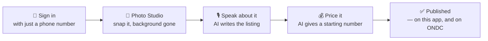
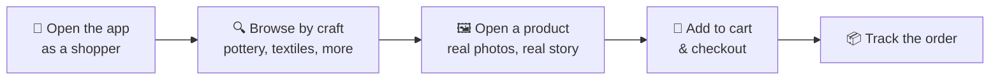
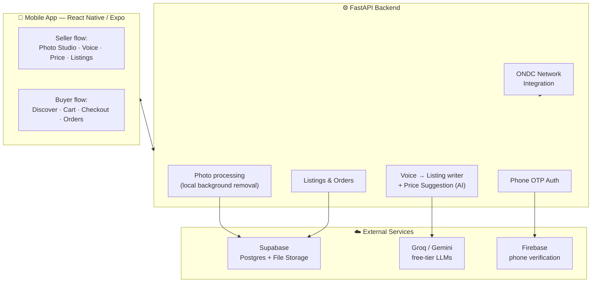

# 🎨 Kalakar Setu

**कलाकार सेतु — "The Artisan's Bridge"**

<p align="center">
  
  
  
  
  
</p>

<p align="center"><i>An app that lets any artisan sell their craft — no photography skills, no English, no guesswork on price.</i></p>

---

## ☀️ A morning in a potter's workshop

It's early. A potter has just finished glazing a set of bowls — hours of real
skill, sitting on a shelf with nowhere to go. She has a smartphone. That's it.

No photographer to make the bowls look sellable. No confidence writing a
listing in English. No idea what a "fair price" even means for something
she's never sold outside her own street.

That's the exact moment Kalakar Setu is built for.

She opens the app. She takes one photo with her phone, exactly as it is —
bowls, cluttered table, ordinary daylight. She presses record and talks about
the bowls in her own language, the way she'd explain them to a neighbour. In
the time it takes to make a cup of chai, she has: a clean catalog-style
photo with the background removed, a polished listing written for her, a
sensible starting price — and it's live, not just on this app, but reachable
across India's wider ONDC commerce network too.

This README tells that story twice: once from her side, as a seller, and
once from a customer's side, buying something genuinely handmade. Then it
gets technical, for anyone who wants to know how it actually works.

---

## 🎥 See It In Action

<p align="center">
  <a href="https://youtu.be/0_EtsJJmUxI">
    
  </a>
  <br>
  <a href="https://youtu.be/0_EtsJJmUxI"><strong>▶️ Watch the full demo</strong></a>
</p>

<p align="center">
  <a href="https://expo.dev/accounts/adi-expo123s-team/projects/aditya-k-v/builds/0d5d86d2-1e9d-4dab-bda7-0fd9afb3a0d7">
    
  </a>
  <br><br>
  <a href="https://expo.dev/accounts/adi-expo123s-team/projects/aditya-k-v/builds/0d5d86d2-1e9d-4dab-bda7-0fd9afb3a0d7"><strong>📲 Tap to download</strong></a>
  &nbsp;·&nbsp; or scan the QR code above
</p>

### 🗺️ What's Actually Happening in That Video

The recording follows **one real painting** — a Thanjavur-style piece on a
bamboo scaffold — all the way from a seller's phone camera to a buyer's
doorstep, and the payment landing back in the seller's pocket. Here's the
full round trip:

```mermaid
flowchart TD
    A["📲 Open the app<br/>Choose a language"]:::seller --> B["📱 Phone number<br/>+ OTP verification"]:::seller
    B --> C["➕ Tap 'Add Product'"]:::seller
    C --> D["📸 Photograph the painting<br/>Thanjavur-style, on a bamboo scaffold"]:::seller
    D --> E["✨ AI cleans up the photo<br/>background removed, studio look"]:::ai
    E --> F["📝 AI writes the<br/>product description"]:::ai
    F --> G["💰 AI price prediction<br/>₹3,500 – ₹6,500 range<br/><b>suggests ₹4,500</b>"]:::ai
    G --> H["🔢 Seller sets quantity"]:::seller
    H --> I(["🚀 Live on the<br/>Kalakar Setu marketplace"]):::system

    I --> J["🛍️ A buyer opens the app<br/>browses the marketplace"]:::buyer
    J --> K["🖼️ Spots the<br/>Thanjavur painting"]:::buyer
    K --> L["🛒 Adds it to cart"]:::buyer
    L --> M["📍 Enters delivery address"]:::buyer
    M --> N["✅ Places the order"]:::buyer

    N --> O["📦 Seller updates<br/>the order status"]:::seller
    O --> P(["🚚 Order delivered"]):::system
    P --> Q["💵 Payment credited<br/>to the seller"]:::system
    Q --> R["📊 Shows up under<br/>'Paid Sales' on the seller's home screen"]:::seller

    classDef seller fill:#8B2500,stroke:#5c1800,color:#fff,font-weight:bold
    classDef buyer fill:#0f766e,stroke:#0b544e,color:#fff,font-weight:bold
    classDef ai fill:#d97706,stroke:#a65c04,color:#fff,font-weight:bold
    classDef system fill:#4a5568,stroke:#2d3340,color:#fff,font-weight:bold
```



<sub>🟤 Seller actions &nbsp;·&nbsp; 🟠 AI doing the work &nbsp;·&nbsp; 🟢 Buyer actions &nbsp;·&nbsp; ⚪ Marketplace / system events</sub>

**In plain words:**

1. **Getting in** — the seller picks a language, types their phone number,
   and confirms the OTP. No password to create or forget.
2. **Meet the painting** — a single, ordinary photo of a Thanjavur-style
   painting propped against a bamboo scaffold, taken exactly as it looks in
   the workshop.
3. **The AI does three jobs in a row** — it lifts the painting off that
   busy background, writes a real product description from scratch, and
   proposes a price. In this case it looked at the piece and suggested a
   ₹3,500-₹6,500 range, settling on **₹4,500** as the sweet spot — the
   seller could accept that or override it.
4. **One tap to go live** — quantity set, and the painting is published to
   the Kalakar Setu marketplace.
5. **Switch hats — now we're the buyer** — browsing the marketplace, the
   painting gets discovered, dropped into the cart, an address goes in, and
   the order is placed.
6. **Back to the seller** — the order shows up on their side, they mark it
   as shipped/delivered.
7. **The loop closes** — once delivered, the payment lands with the seller
   and shows up right there in their **Paid Sales** figure on the home
   screen — the same number a seller glances at every time they open the
   app.

---

## 📖 Table of Contents

- [The Seller's Side 🧑‍🎨](#-the-sellers-side)
- [The Buyer's Side 🛍️](#-the-buyers-side)
- [Under the Hood — How It's Built](#-under-the-hood--how-its-built)
- [Tech Stack](#-tech-stack)
- [Project Structure](#-project-structure)
- [Running It Locally](#-running-it-locally)
- [Honest Limitations & What's Next](#-honest-limitations--whats-next)

---

## 🧑‍🎨 The Seller's Side

Picture the whole thing as four short stops, not four complicated forms.



### Signing in feels like nothing

No email to remember, no password to forget. A one-time code sent by SMS,
and you're in. First time here, the app asks three quick things: what
language you're comfortable in (English, हिन्दी, or मराठी), what you make,
and roughly where you're based — that's it, no forms.

### The camera does the hard part for you

Open Photo Studio, and before you even shoot, the app quietly coaches you —
*hold steady, find some light, keep the background simple* — because a
better first photo means less work later. Take the photo (or pick one
already in your gallery), and the app automatically lifts your product off
whatever cluttered table or floor it was sitting on and places it on a clean
white studio background. Slide left and right to compare the original and
the cleaned-up version side by side, and pick from a few background shades
if you want.

### You talk. It writes.

Tap the mic and describe your product the way you'd describe it to a real
customer standing in front of you — what it's made of, how long it takes to
make, what makes this piece special. Say it in whichever of the three
languages is easiest. An AI model listens, and turns your words into an
actual marketplace listing — title, description, materials, keywords — and
writes it out in **all three languages** at once, not just the one you spoke
in. Before anything goes live, you see exactly what it wrote and can edit or
redo it.

### Pricing without the guesswork

A "Get AI Price Suggestion" button looks at your craft type, materials, and
region, and hands you a price range with a one-line reason why. It's a
sensible starting point — you always have the final say on the number, and
the app is upfront that this is an estimate, not a guarantee pulled from
real sales data.

### A shop that's easy to run

Once published, your product shows up in **My Products**, where you can
edit it, share it (say, on WhatsApp), or take it down — and an **Orders**
tab keeps you posted on what's coming in. And because the listing also flows
out to **ONDC**, India's open commerce network, it can be discovered on other
shopping apps connected to that network too — without you lifting a finger
for it.

---

## 🛍️ The Buyer's Side



Switch over to the customer side, and it feels like any shopping app you'd
already know how to use — except everything you're looking at is real. The
photo you see is the artisan's own photo, cleaned up but not staged. The
description is what they actually said about their own work, not marketing
copy. You can filter by craft category, tap into any product for the full
picture, add it to your cart, check out, and track the order afterward —
all in whichever of the three languages you're most comfortable reading in.

---

## 🧩 Under the Hood — How It's Built

Everything above is what people see. Here's what's actually running
underneath it.



A few deliberate choices worth calling out:

- **The background removal runs entirely on the backend server itself** —
  no external image API, no per-photo cost, no photo ever leaving the app's
  own infrastructure to some third-party AI service.
- **The listing writer and price suggestion lean on free-tier LLMs**
  (Groq first, Gemini as a fallback). If neither is configured, the app
  doesn't break — it quietly falls back to a simpler keyword-based listing
  builder instead.
- **Everything is trilingual by construction**, not translated as an
  afterthought — every screen, every AI-generated listing, and every price
  explanation exists in English, Hindi, and Marathi from the same source of
  truth.

---

## 🛠️ Tech Stack

| Layer | Technology |
|---|---|
| **Mobile app** | React Native, [Expo](https://expo.dev) (Expo Router for navigation) |
| **Backend API** | [FastAPI](https://fastapi.tiangolo.com) (Python), SQLAlchemy (async) |
| **Database** | Supabase Postgres |
| **File storage** | Supabase Storage (product photos) |
| **Authentication** | Phone number + OTP, verified via Firebase |
| **AI — listing writer & price suggestion** | Groq / Google Gemini (free-tier LLMs) |
| **AI — background removal** | [rembg](https://github.com/danielgatis/rembg), running locally — no external API |
| **Deployment** | Railway (backend, via Docker), EAS Update (over-the-air app updates) |
| **Localization** | English, Hindi (हिन्दी), Marathi (मराठी) — throughout, not bolted on |

---

## 📁 Project Structure

```
ks-v2/
├── frontend/                        # React Native (Expo) mobile app
│   ├── app/                         # Screens (file-based routing via Expo Router)
│   │   ├── (auth)/                  #   Phone login, language, consent
│   │   ├── (onboarding)/            #   Name, craft, location setup
│   │   ├── (app)/(tabs)/            #   Seller: Home, Products, Orders, Profile
│   │   ├── (app)/(customer-tabs)/   #   Buyer: Discover, Cart, Orders, Profile
│   │   └── (app)/studio/            #   Photo Studio, Voice, Price steps
│   ├── features/                    # Auth, catalog draft, theming
│   └── locales/                     # en.json / hi.json / mr.json translations
│
└── backend/                         # FastAPI application
    ├── app/
    │   ├── api/routes/              # auth, media, catalog, listing, pricing, orders...
    │   ├── services/                # image processing, LLM calls, storage
    │   ├── models/                  # Database tables (SQLAlchemy)
    │   └── integrations/ondc/       # ONDC network integration
    └── alembic/                     # Database migration history
```

---

## 🚀 Running It Locally

> A full production deployment walkthrough (backend hosting, environment
> variables, building the mobile app) lives in [`DEPLOYMENT.md`](DEPLOYMENT.md).

**Backend:**
```bash
cd backend
python -m venv venv && source venv/bin/activate   # or venv\Scripts\activate on Windows
pip install -r requirements.txt
cp .env.example .env    # fill in your own DATABASE_URL, etc.
alembic upgrade head
uvicorn app.main:app --reload --port 8000
```

**Frontend:**
```bash
cd frontend
npm install
cp .env.example .env    # set EXPO_PUBLIC_API_URL to your backend's address
npx expo start
```

Scan the QR code with **Expo Go**, or run it on an emulator, to open the app.

---

## 🔍 Honest Limitations & What's Next

No pretending everything is finished:

- **Price suggestions are AI estimates**, not real market data pulled from
  actual sales — a helpful starting point, not a guarantee.
- **ONDC integration currently covers product search/discovery only** — the
  full buy-through-ONDC transaction flow isn't built yet.
- **SMS delivery runs in "mock" mode by default** for local development — a
  real SMS provider (e.g. Twilio) needs configuring for OTPs to reach real
  phones outside of Firebase's own verification.
- If neither Groq nor Gemini is configured, listing generation **falls back
  to a simpler keyword-based builder** rather than failing outright.

---

<p align="center">Made so an artisan's skill is the only thing that has to be impressive.</p>
